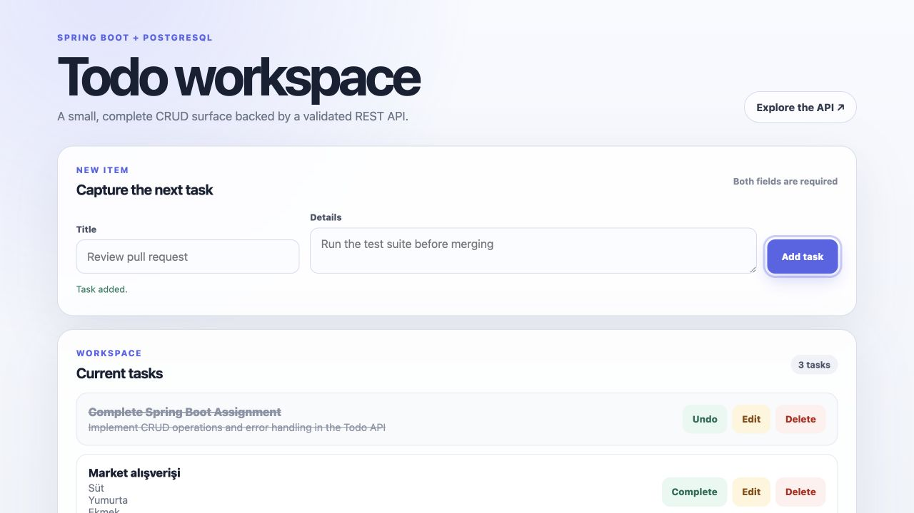
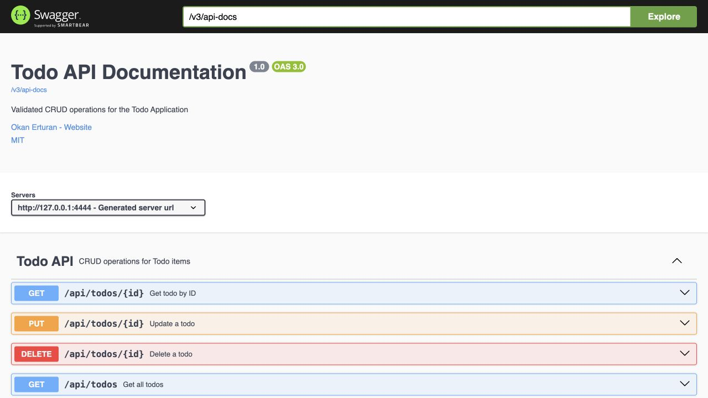

# Todo Application

A compact full-stack todo application built with Spring Boot 3, PostgreSQL, and a framework-free browser UI. It exposes a validated REST API, documents that API with OpenAPI, rejects duplicate todos, and ships with a reproducible Docker Compose development environment.

> **Project status:** Complete learning assignment, maintained as a portfolio example. It is not a hosted production service. The repository demonstrates the application locally and verifies its behavior in CI.

## Verified product proof

The browser UI and generated API documentation below were captured from the same local Docker Compose stack. The UI capture follows a successful create against PostgreSQL; the same browser session then completed and edited that persisted item with the expected live feedback. The API view is generated from the running Spring application.





## What it demonstrates

- CRUD operations through both a browser interface and REST endpoints
- A responsive, keyboard-visible browser UI with labeled fields, live operation feedback, task counts, and empty/error states
- A controller-service-repository architecture with DTO validation
- PostgreSQL persistence with an H2-backed integration-test profile
- Conflict, validation, and missing-resource error handling
- Generated OpenAPI documentation and Swagger UI
- A container image built from source and a two-service Docker Compose stack
- Opt-in, idempotent sample data for local demonstrations

## Architecture

```text
Browser UI / API client
          |
          v
    TodoController  -- request validation and HTTP responses
          |
          v
      TodoService   -- CRUD rules and duplicate detection
          |
          v
    TodoRepository  -- Spring Data JPA
          |
          v
      PostgreSQL
```

The browser UI is served by the same Spring Boot process, so it calls the API on the same origin. Cross-origin access is not enabled by default.

## Run with Docker Compose

Requirements: Docker with Compose v2.

```bash
git clone https://github.com/okturan/techcareer_todo_assignment.git
cd techcareer_todo_assignment
cp .env.example .env
docker compose up --build
```

Then open:

- Application: <http://localhost:4444>
- Swagger UI: <http://localhost:4444/swagger-ui/index.html>
- OpenAPI JSON: <http://localhost:4444/v3/api-docs>
- Health check: <http://localhost:4444/actuator/health>

The checked-in `.env.example` contains local-only development values. Change the password before using the stack anywhere other than your machine, and never commit the resulting `.env` file.

Stop the stack with `docker compose down`. Add `--volumes` only when you intentionally want to delete the local database volume.

## API

| Method | Path | Purpose |
| --- | --- | --- |
| `GET` | `/api/todos` | List todos |
| `GET` | `/api/todos/{id}` | Read one todo |
| `POST` | `/api/todos` | Create a todo |
| `PUT` | `/api/todos/{id}` | Replace a todo |
| `DELETE` | `/api/todos/{id}` | Delete a todo |

Create an item:

```bash
curl --request POST http://localhost:4444/api/todos \
  --header 'Content-Type: application/json' \
  --data '{"title":"Review pull request","details":"Run the test suite first"}'
```

Both `title` and `details` must be non-blank. Creating or updating another item with the same title and details returns `409 Conflict`.

## Run without containers

Use Java 17 and a reachable PostgreSQL database. Copy `.env.example`, set `TODO_DB_URL` to the database's JDBC URL, and export the variables before running the Maven wrapper:

```bash
set -a
source .env
set +a
./mvnw spring-boot:run
```

The application fails closed when the database URL, username, or password is absent. Schema changes and demo data are also explicit configuration choices:

| Variable | Required/default | Purpose |
| --- | --- | --- |
| `TODO_DB_URL` | required | PostgreSQL JDBC URL |
| `TODO_DB_USERNAME` | required | Application database user |
| `TODO_DB_PASSWORD` | required | Application database password |
| `TODO_DDL_AUTO` | `validate` | Hibernate schema policy; Compose uses `update` for local development |
| `TODO_SEED_ENABLED` | `false` | Load two demonstration todos when the table is empty |
| `SERVER_PORT` | `4444` | HTTP port |

## Tests and verification

```bash
./mvnw --batch-mode verify
docker build --tag techcareer-todo-assignment:local .
```

The integration tests exercise the API's create/read/update/delete lifecycle, duplicate detection, validation, missing-resource behavior, static UI, and OpenAPI contract. GitHub Actions runs the suite on Java 17 and verifies that the container image builds from a clean checkout.

## License

Project-authored source is available under the [MIT License](LICENSE). Third-party dependencies and generated Maven wrapper files remain under their respective licenses.
